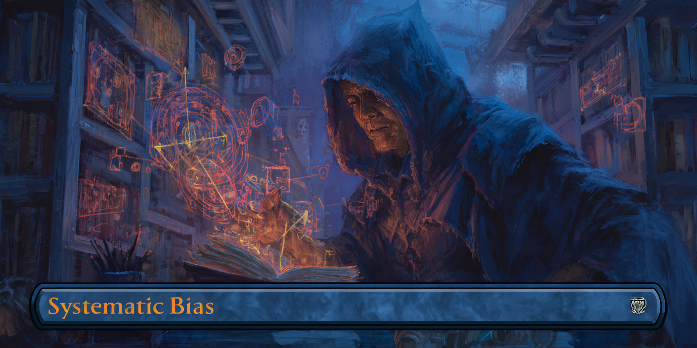

# The Label Noise That Actually Kills Your Model

After debugging countless production models over 16 years, I've learned something counterintuitive: your training data doesn't have to be perfect. A model can handle up to 10% random label errors without significant degradation. Instead, invest your time perfecting your evaluation labels and rooting out any systematic labeling errors.

Consider crack detection on power line cross arms; annotators will inevitably miss some cracks while labeling. These errors are survivable. What kills your model isn't randomly missing some cracks, it's systematically missing cracks in shadows, near metal hardware, or on weathered wood. That's the difference between noise your model can ignore and bias it will learn to emulate.

## Models Tolerate Random Noise

If you flip a coin to randomly mislabel 5% of your samples, those errors don't teach your model anything consistent. One sample with a crack gets mislabeled as "no crack", but the next visually similar crack is correctly labeled. There's no pattern to learn.

Recent research confirms this tolerance. ["On the Role of Label Noise in the Feature Learning Process"](https://arxiv.org/abs/2505.18909) (2025) shows models learn to fit clean samples while ignoring noisy ones. Your model will handle 5-10% random label noise as long as you are using proper validation techniques to prevent overfitting to mislabeled samples.

## Perfect Your Evaluation Data

While your model can ignore random label noise during training, labeling errors in your validation and test sets will distort your decision metrics. These are the metrics used to control overfitting, select production models, and set performance expectations. Distorted metrics lead to incorrect decisions.

The good news: evaluation sets are typically 10-20x smaller than training data. The time it takes to reduce labeling errors from 5% to near 0% in your evaluation data equals the time needed to reduce training set noise by just 0.5-1%. The math is simple: invest 3-5x more annotation time per sample in your evaluation data to ensure you are making optimal modeling decisions.

## The Real Killer: Systematic Labeling Patterns

Unlike random noise that averages out, systematic labeling errors create patterns your model will learn and emulate. If the signal from these false patterns is stronger than the true signal, your model will greedily exploit the bias.

Here are three examples from power line cross arm inspection:

**Hardware occlusion bias**: Annotators consistently miss cracks near metal brackets and bolts. The model learns "areas near hardware are unlikely to have cracks" which creates a major blind spot for critical failure points.

**Weathering bias**: Severely weathered cross arms develop rough surfaces where structural cracks blend in. Annotators systematically miss these, teaching the model to ignore weathered sections.

**Lighting bias**: Cracks partially in shadow are harder to trace. Annotators often overlook these, so the model learns shadows don't have cracks and now its performance depends on the time of day when the image was captured.

## Quickly Find Glaring Biases

Collect 20-30 examples where your model made a high-confidence prediction (>70%) that was incorrect; e.g., images where the model predicted "no crack" with high confidence, but validation shows a missed crack.

Look for patterns in these failures. Are the missed cracks all near metal hardware? That's hardware occlusion bias. All on dry-rotted wood sections? Weathering bias. All partially in shadow? Lighting bias. Check other metadata: image capture time, camera model, etc.

If you see clustering, quantify it relative to the rest of your data. If half the incorrect examples are weathered cross arms, but the overall dataset contains only 20% weathered arms, that's a strong indication the model is attuned to a false pattern introduced by labeling bias.

This manual review takes less than an hour and has saved me weeks of debugging on multiple projects.

## Takeaway

Next time your model underperforms, don't start by exhaustively cleaning labels. Instead:

First, audit your training data for systematic errors. Pull 20-30 high-confidence wrong predictions and look for patterns. If you find systematic bias, you must eradicate it.

Second, invest in improving the quality of your evaluation data. Use multiple annotators with consensus labeling. Get domain expert review for edge cases. Budget 3-5x more time per sample than your training set. You can't make optimal decisions if you don't trust your evaluation data.

---

[Back to Contents](../README.md#field-notes)