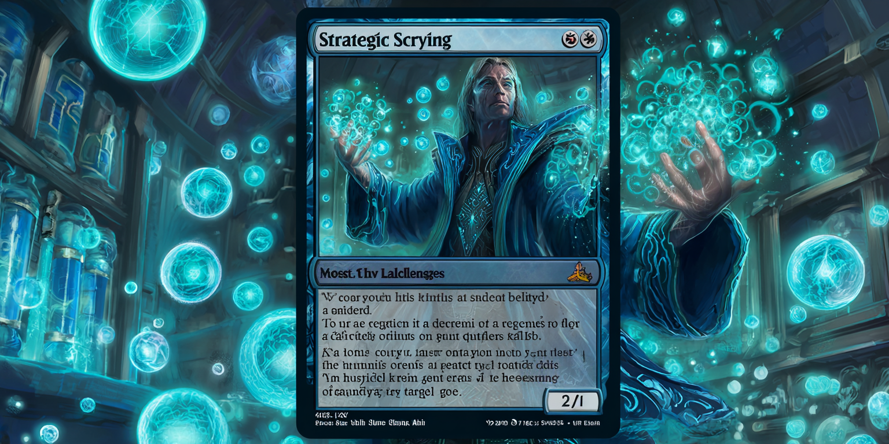

# Which Samples Should You Label Next?

You've got a backlog of 100,000 unlabeled datapoints but time and budget to annotate only 500 this sprint. Which ones should you pick?

This isn't academic. For nearly all supervised learning tasks, collecting and labeling training data is your biggest cost; not model training itself. The human time investment to assign labels and review quality is immense. Supervised models require thousands if not millions of annotated samples to learn useful patterns. Even if data collection and annotation are cheap ($0.50 / sample) your annotation budget will dwarf your training bill. More importantly, data annotation takes significantly longer (weeks or months) than model training (hours or days) which is often the biggest bottleneck to model development cycles.

You want to maximize model progress each development cycle. This means maximizing the learning opportunities in the samples you are adding to your training data - so which samples do you select to achieve this? The answer is the ones your model can learn the most from (i.e. the ones it's most challenged or confused by). But only prioritizing these examples is not enough. You'll end up annotating hundreds of slightly different examples of only the worst edge cases for your *current* model.

The better answer: prioritize sample diversity first, then model uncertainty within each diverse bucket.

## Why Uncertainty Alone Fails
Imagine a model that detects if workers are wearing their hard hat in a heavy construction zone. Maybe the model currently struggles when a worker's hard hat is partially obscured. You want to improve on this, but you don't want your entire sample budget to be of only partially obscured hard hats. Your model has other weak points you need to focus on too (hard hat color, worker pose, hat vs. hard hat, etc.). If you sample exclusively from samples with the highest model uncertainty, you will burn the majority of your annotation budget on slight variations of one problem area.

Worse, this creates additional negative impacts:

1. **Catastrophic forgetting:** Your model gets significantly worse in areas it was once very good at (e.g., it gets better at detecting partially obscured hard hats but forgets how to detect hard hats on workers directly in front of the camera).
2. **Distribution drift:** Your training set stops looking like the data distribution your model will see in production (e.g., the model begins to expect that hard hats will usually be obscured when the reality is totally opposite).

## Why Diversity Alone Fails
Sampling based on data diversity is always a safe bet. We want our model to generalize across all of our data rather than learning patterns that work for specific pockets. That said, if you pick the 500 most diverse samples for this annotation round, you might label a bunch of easy, well-separated examples your model already handles fine. You're burning annotation budget by not maximizing incremental learning.

## Cluster Before You Sample
The key insight: Diversity first guarantees you're sampling from across your data. Uncertainty second guarantees you're maximizing incremental learning within each region of the space.

1. **Cluster your unlabeled pool of data.** Use embeddings from one of your model's later stage layers to cluster all unlabeled examples. Aim for 20-50 clusters depending on your dataset size and diversity.

2. **Calculate uncertainty scores.** Run inference and get model uncertainty for every unlabeled example. There are many ways to estimate model uncertainty, but a reliable approach is to train 3 versions of a model on random subsets of your training data and check for significant prediction disagreement between any two models on unlabeled examples.

3. **Sample top-k uncertain per cluster.** Within each cluster, take the most uncertain examples. If you need 500 labels across 25 clusters, that's ~20 per cluster. This guarantees diversity because you're forced to sample from every region of your data space, while focusing your attention on the most uncertain examples in each region.

Think of it like studying for an exam. You want to practice problems you struggle with (model uncertainty), but you need to make sure you're covering all topics (data diversity). 

## Takeaway

Before your next annotation sprint, do this: cluster your unlabeled data into 20-50 groups, calculate your model's uncertainty scores for each sample, then sample the top-N most uncertain from each cluster. You're guaranteeing diversity while maximizing learning signal per labeled sample.

---

[Back to Contents](README.md)